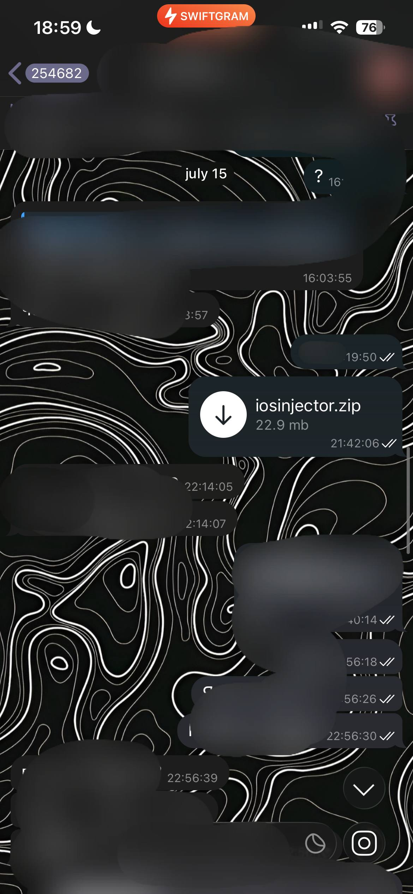
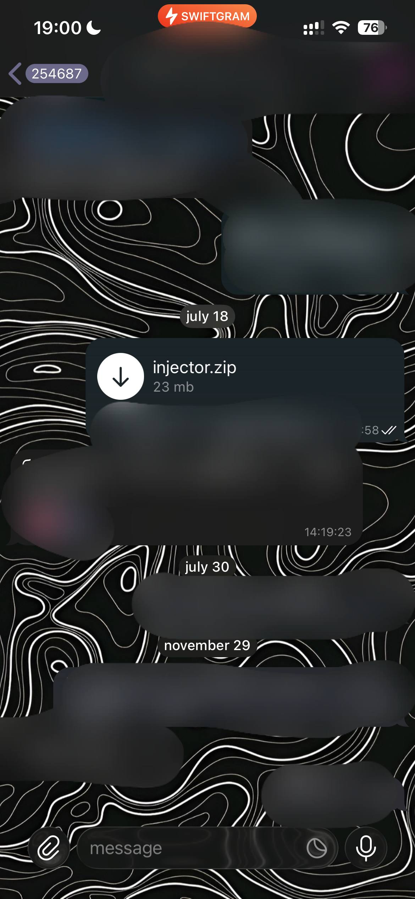

# iOS Injector Source Code
Since my friend andr released the source code of  publicly, there's no point keeping mine private anymore. I developed my version four months earlier than andr's, so now sharing it openly.

## Background
This project is basically a combination of opainject and ChOma, created long before andr published his injection method, which is better than mine. Furthermore, this app doesn't work with TrollStore because it uses setgid/setuid privilege escalation, which is prohibited in the SpringBoard app. The code is messy, but I don't care, since I don't even use it.

**If you want to make a really good cheat, then I strongly recommend to use  source instead of mine. This project will never get further updates!**

## Proofs

Proof from chat screenshots where I shared my source with some people.

    
    

## Terms of Usage
If you are pasting this into your cheat/project, please mention me there. Don't bed rude paster pwease 😘

## Credits
 - opa334 - signing exploit from  and 
